# O Problema das Esferas Distantes em Uma Cena Ortográfica

## 1. Contextualização

Como vimos em aula, os objetos em uma cena renderizada com uma câmera ortográfica (i.e. raios da câmera são todos paralelos)
devem aparecer sem distorção, independente de suas distâncias para a câmera.

Por exemplo, considere uma cena renderizada com câmera ortográfica que contém 2
esferas de raio 5, uma posicionada à 10 metros de distância da câmera e a outra
à, digamos, 1Km de distância da mesma câmera; na imagem resultante, ambas esferas devem
aparecer com o mesmo tamanho.

## 2. O Problema

No cenário anterior, se posicionarmos uma das esferas a uma distância muito
grande da câmera, o teste de interseção rápido (`intersect_p()`) pode não
funcionar corretamente.

Isso acontece por erro de arredondamento na aritmética de ponto flutuante no
cálculo do **delta** (discriminante).
Lembre que o sinal do delta é avaliado na função de interseção rápida para
decidir se há ou não interseção entre um raio primário da câmera e uma esfera da cena.

## 3. Análise do problema

De acordo com o [material complementar](./sphere_ray.pdf) sobre como calcular a
interseção entre um raio e uma esfera, temos que o discriminante é dado por:

$$\Delta = ((\mathbf{o} - \mathbf{c}) \cdot \mathbf{d})^2 - (\mathbf{d} \cdot \mathbf{d})((\mathbf{o} - \mathbf{c}) \cdot (\mathbf{o} - \mathbf{c}) - r^2)$$

Vamos considerar um cenário hipotético, com a câmera ortográfica posicionada na origem, apontando na direção $Z^+$.
Neste caso, é possível assumir que todos os raios da câmera tem a mesma direção $\hat{\mathbf{d}}=(0,0,1)$.

Neste mesmo cenário, o volume de visualização é determinado por $l=-4$, $r=+4$, $b=-3$, $t=+3$.

Posicionamos uma esfera, com centro $c=(-1.5, -1.5, 10000)$, e raio $r=0.4$.

Essa descrição corresponde a uma das cenas de teste do Projeto 03, replicada abaixo:

```xml
<RT3>
    <lookat look_from="0 0 0" look_at="0 0 10" up="0 1 0" />
    <camera type="orthographic" screen_window="-4 4 -3 3"/>
    <film type="image" w_res="800" h_res="600" filename="flat_spheres_ortho.png" img_type="png" gamma_corrected="false" />
    <world_begin/>
        <background type="4_colors" bl="176 214 175" tl="4 99 202" tr="4 99 202" br="176 214 175" />
        <material type="flat" color="220 10 10" />
        <object type="sphere" radius="0.4" center="-1.5 -1.5 10000" />
    <world_end/>
</RT3>
```

Vamos assumir que um raio gerado pela câmera teria $o=(-1.5,-1.5,0)$ e $d=(0,0,1)$.
Neste caso, o vetor $\overrightarrow{(\mathbf{o}-\mathbf{c})}$ fica:

```
o - c = (-1.5 - (-1.5), -1.5 - (-1.5), 0 - 10000)
      = (0, 0, -10000)
```

Calculando cada termo do discriminante:

**Termo A**: $((\mathbf{o} - \mathbf{c}) \cdot \mathbf{d})^2$

```
(o-c)·d = (0)(0) + (0)(0) + (-10000)(1) = -10000
A = (-10000)² = 100000000 ou 10⁸.
```

**Termo B**: $(\mathbf{d} \cdot \mathbf{d})((\mathbf{o} - \mathbf{c}) \cdot (\mathbf{o} - \mathbf{c}) - r^2)$:

```
d·d = 1
(o-c)·(o-c) = 0 + 0 + 10000² = 100000000 = 10⁸
(o-c)·(o-c) - r² = 100000000 - 0.16 = 99999999.84 ≈ 100000000  ← r² some!
B = 1 * 99999999.84
```

**Resultado:**

```
Δ = A - B = 100000000 - 99999999.84 = 0.16 (r²) ≈ 0 (ou negativo por erro de float!)
```

## 4. O Problema Central

O `float` tem apenas **~7 dígitos decimais de precisão**. O valor
`100000000.0f` já ocupa todos eles. Quando você subtrai `r² = 0.16`, essa
subtração é **invisível** para o `float` — o número não tem casas decimais
disponíveis nessa magnitude.

```
float: 100000000.0f - 0.16f = 100000000.0f  // r² é perdido!
```

Isso faz o $\Delta=A-B=0$ ou até levemente negativo por arredondamentos anteriores.

## 5. Soluções

**1. Usar `double` em vez de `float`** (~15 dígitos de precisão): é uma solução
simples mas que apenas empurra o problema mais pra frente (literalmente!)

**2. Reformular algebricamente o teste**: O componente $Z$ de
$\overrightarrow{(\mathbf{o}-\mathbf{c})}$ contribui igualmente para o Termo A e B e se cancela
algebricamente. Desta forma, podemos reescrever o discriminante usando **apenas
os componentes perpendiculares à direção do raio**.

$$\Delta = r^2 - |(\mathbf{o} - \mathbf{c})_\perp|^2$$

Onde $(\mathbf{o} - \mathbf{c})_\perp$ é a parte de $\overrightarrow{(\mathbf{o}-\mathbf{c})}$ perpendicular a $\hat{d}$. Para $\mathbf{d} = (0,0,1)$ isso é simplesmente:

```cpp
float dx = o.x - c.x;  // = -1.5 - (-1.5) = 0
float dy = o.y - c.y;  // = -1.5 - (-1.5) = 0
float discriminant = r*r - (dx*dx + dy*dy);
// = 0.16 - 0 = 0.16  ✓  detecta colisão corretamente!
```

Essa reformulação **elimina o erro de arredondamento** ao nunca construir os
termos gigantes que se anulam.

Para o caso geral (direção de raio arbitrária), utiliza-se a projeção vetorial de
$\overrightarrow{(\mathbf{o}-\mathbf{c})}$ no plano perpendicular a $\hat{d}$.

## 6. Explicação Geométrica e Algébrica

### 6.1 Geometricamente, o que o discriminante mede?

O discriminante da equação de interseção raio-esfera mede se o raio passa
dentro da esfera. Mais especificamente, ele codifica a **distância
perpendicular** entre a linha do raio e o centro da esfera.



### 6.2 A intuição geométrica

O raio gerado pela câmera é uma **linha infinita** no espaço. A pergunta "o
raio colide com a esfera?" é equivalente a perguntar:

> A distância mínima entre a linha do raio e o centro da esfera é menor que `r`?

Essa distância mínima é exatamente $|(\mathbf{o}-\mathbf{c})_\perp|$ — o comprimento ou magnitude da componente de $\overrightarrow{(\mathbf{o}-\mathbf{c})}$ **perpendicular**
a $\hat{d}$.

#### Por que a componente paralela some algebricamente?

Podemos decompor o vetor $\overrightarrow{(\mathbf{o}-\mathbf{c})}$, em seus componentes paralelo e perpendicular a $\hat{d}$, desta forma:

$$ \overrightarrow{(\mathbf{o}-\mathbf{c})} = \overrightarrow{(\mathbf{o}-\mathbf{c})}_\parallel + \overrightarrow{(\mathbf{o}-\mathbf{c})}_\perp\tag{1}$$

> [!NOTE]
> O vetor e seus 2 componentes formam um triângulo retângulo.

O discriminante original, expandido, vira:

$$ \Delta = \underbrace{((\mathbf{o}-\mathbf{c})\cdot \mathbf{d})^2}_{\text{Termo A}} - \underbrace{(\mathbf{d}\cdot\mathbf{d})((\mathbf{o}-\mathbf{c}) \cdot (\mathbf{o}-\mathbf{c}) - r^2 )}_{\text{Termo B}}\tag{2}$$

#### Trabalhando o Termo A

Substituindo a decomposição (Equação 1) no **Termo A** da Equação 2,
temos:

$$((\mathbf{o}-\mathbf{c}) \cdot \mathbf{d})^2 = ([\overrightarrow{(\mathbf{o}-\mathbf{c})}_\parallel + \overrightarrow{(\mathbf{o}-\mathbf{c})}_\perp] \cdot \mathbf{d})^2 = ((\mathbf{o}-\mathbf{c})_\parallel \cdot \mathbf{d})^2 $$

> [!important]
> O componente perpendicular não contribui, pois como vimos,
> $(\mathbf{o}-\mathbf{c})_\perp \cdot d=0$, já que se trata de um produto
> escalar entre dois vetores perpendiculares entre si.

A componente de $(\mathbf{o}-\mathbf{c})_\parallel$, paralela a $\mathbf{d}$, é definida como
sendo o **vetor projeção** (visto na aula de revisão matemática) de
$(\mathbf{o}-\mathbf{c})$ sobre $\mathbf{d}$, calculado pela equação:

$$(\mathbf{o}-\mathbf{c})_\parallel = \underbrace{\left(\frac{(\mathbf{o}-\mathbf{c}) \cdot \mathbf{d}}{|\mathbf{d}|^2}\right)}_{\text{escalar}\ \lambda} \mathbf{d}$$

Isso é um **vetor** na direção de $\mathbf{d}$, com comprimento $\lambda\, |\mathbf{d}|$.

Agora, temos que $(\mathbf{o}-\mathbf{c})_\parallel = \lambda\,|\mathbf{d}|$, portanto o **Termo A** fica:

$$( (\lambda \mathbf{d}) \cdot \mathbf{d} )^2 = [\lambda\, |\mathbf{d}|^2]^2 = \lambda^2\, |\mathbf{d}|^4$$

#### Trabalhando o Termo B

Já para o **Termo B**, devemos considerar que:

- $(\mathbf{d} \cdot \mathbf{d}) = |\mathbf{d}|^2$ (produto escalar do mesmo vetor é o quadrado de sua magnitude).
- E que $(\mathbf{o}-\mathbf{c})\cdot (\mathbf{o}-\mathbf{c})=|(\mathbf{o}-\mathbf{c})|^2 =|(\mathbf{o}-\mathbf{c})_\parallel|^2 + |(\mathbf{o}-\mathbf{c})_\perp|^2$.
- $|(\mathbf{o}-\mathbf{c})_\parallel|^2=(\lambda|\mathbf{d}|)^2= \lambda^2|\mathbf{b}|^2$

Portanto, o **Termo B** fica:

$$ (\mathbf{d}\cdot\mathbf{d})((\mathbf{o}-\mathbf{c}) \cdot (\mathbf{o}-\mathbf{c}) - r^2 ) = |\mathbf{d}|^2\left(\lambda^2|\mathbf{d}|^2 + |(\mathbf{o}-\mathbf{c})_\perp|^2 - r^2\right)$$

#### Trabalhando o discriminante

Combinando os **Termos A** e **B**, temos:

$$\Delta = \lambda^2 |\mathbf{d}|^4 - |\mathbf{d}|^2\left(\lambda^2|\mathbf{d}|^2 + |(\mathbf{o}-\mathbf{c})_\perp|^2 - r^2\right)$$

$$= \cancel{\lambda^2 |\mathbf{d}|^4} - \cancel{\lambda^2|\mathbf{d}|^4} - |\mathbf{d}|^2|(\mathbf{o}-\mathbf{c})_\perp|^2 + |\mathbf{d}|^2 r^2$$

$$= |\mathbf{d}|^2\left(r^2 - |(\mathbf{o}-\mathbf{c})_\perp|^2\right)$$

Portanto, é possível perceber que o sinal de $\Delta$ é determinado só por
$r^2 - |(\mathbf{o}-\mathbf{c})_\perp|^2$, já que $|\mathbf{d}|^2>0$ sempre.

Note que essa nova formulação para $\Delta$ envolve números de uma grandeza
menor, visto que não depende da distância da esfera para câmera.

### Aplicando no Ray Tracer

Para se livrar do problema da imprecisão com esferas muito distantes,
é necessário avaliar o sinal de $\Delta$ calculado como demonstrado
na seção anterior.

```cpp
// Lembre que (o-c) = (o−c)⊥ + (o-c)∥ e que
// (o-c)∥ = [(o−c)·d̂]/|d|² * d̂ (equação da projeção de um vetor sobre o outro)
// (o−c)⊥ = (o−c) - [(o−c)·d̂] * d̂ , (sendo d̂ o vetor d normalizado)
Vec3 oc = o - c;
float parallel_len = dot(oc, d_hat);       // escalar: comprimento componente paralelo de oc.
Vec3 oc_perp = oc - parallel_len * d_hat;  // componente perpendicular de oc.
float delta = r*r - dot(oc_perp, oc_perp); // estável numericamente!
```
