**COMPUTER GRAPHICS I (DIM0451) -- Ray Tracer Project**

# Project 05 - The Blinn-Phong Reflection Model

<!--toc:start-->

- [Project 05 - The Blinn-Phong Reflection Model](#project-05-the-blinn-phong-reflection-model)
  - [1. Introduction](#1-introduction)
  - [2. New Entities Your RayTracing Needs to Support](#2-new-entities-your-raytracing-needs-to-support)
    - [2.1 Support Light Sources](#21-support-light-sources)
    - [2.2 Support New Material](#22-support-new-material)
    - [2.3 Implement `BlinnPhongIntegrator`](#23-implement-blinnphongintegrator)
  - [3. The Blinn-Phong Reflection Model](#3-the-blinn-phong-reflection-model)
    - [3.1 The Lambertian Reflection (aka diffuse contribution)](#31-the-lambertian-reflection-aka-diffuse-contribution)
    - [3.2 The Specular Reflection (aka specular contribution)](#32-the-specular-reflection-aka-specular-contribution)
      - [BLinn Contribution to the Model](#blinn-contribution-to-the-model)
    - [3.3 The Last Component: the Ambient Contribution](#33-the-last-component-the-ambient-contribution)
    - [3.4 Multiple Lights and the Final BPRM Equation](#34-multiple-lights-and-the-final-bprm-equation)
  - [4. The Scene File Format](#4-the-scene-file-format)
  - [5. Extra Feature: light attenuation](#5-extra-feature-light-attenuation)
  <!--toc:end-->

## 1. Introduction

After learning how to set up a virtual scene with multiple objects and generate
viewing rays from a virtual camera, it is time to understand how to **shade** or
assign a color to the closest intersection points between ray and objects.
Proper color assignment is essential for creating a _three-dimensional_ (3D)
image that exhibits hidden surfaces and a sense of _depth_. Shadows and the
color variation on the object's surface caused by the light sources in the scene
also contribute to achieving the desired 3D appearance in rendered images.

In this programming project you will create a new integrator, called
`BlinnPhongIntegrator`, which implements the [Blinn-Phong Reflection
Model](https://en.wikipedia.org/wiki/Blinn–Phong_reflection_model) (BPRM). This
empirical model of local illumination tries to roughly approximate how a surface
reflects light by considering two main components:
[**diffuse**](https://en.wikipedia.org/wiki/Diffuse_reflection) reflection,
commonly found in rough surfaces such as wood or clay,
and [**specular**](https://en.wikipedia.org/wiki/Specular_reflection)
reflection, commonly found in shiny surfaces such as polished
metal. Simply put, a _reflection model_ is just a way to _shade_ (color) pixels in
images based on factors like _light sources_ and _material properties_. To
accomplish this, you need to add a **new material** called `BlinnMaterial` and
create a new class to represent **light** entities.
To enhance the realism of the scene, your integrator should cast **hard shadows**.

Below is an example image created using the Blinn-Phong integrator.

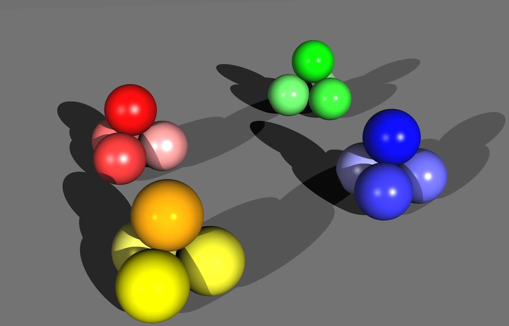

To make it easy to grasp all the technical content involved in generating an image such as the one above,
we are going to split the task into two distinct projects.
In this first project we will focus on an overview of the Blinn-Phong model and
its components.
We also introduce the concept of light and material, necessary to generate the images shown in this repository.

In the next project, we will expand the concepts presented here by introducing
other types of lights, the generation of shadow, as well as the perfect reflection
(aka mirror effect).

## 2. New Entities Your RayTracing Needs to Support

The first step you should do is to read all the suggested materials that explain
the technical aspects of the BPRM. From that reading you should realize that
your ray tracing system needs to create and support new entities, such as _light
sources_, and _material properties_.

This section describes these entities first, whereas the following section
describes the procedure you should follow to shade objects according to the
BPRM.

### 2.1 Support Light Sources

You should implement the following light types to begin with:

- **Point light**: It is an infinitesimally small sphere of light with a 3D
  location in space that _emits light rays in all directions_. When a light ray
  strikes a surface, it does so in a specific direction determined by a vector
  from the strike location on the surface to the point light location in the world
  space.
- **Directional light**: It is light source located so far away that all
  incoming light rays reaching a surface are parallel (similar to the sun) and
  _follow a single direction_.
- **Ambient light**: This is a "fake" light created solely to simulate the
  amount of diffusely reflected light in a scene. It means that all objects are
  affected by this light, regardless of their location in the scene. Therefore, we
  only need to set a single ambient light for the entire scene, and this light
  contribution should be added to all light calculations. Typically, we set this
  value to a small amount, such as `[0.1, 0.1, 0.1]`.

Below we have an image representing a _point light_.

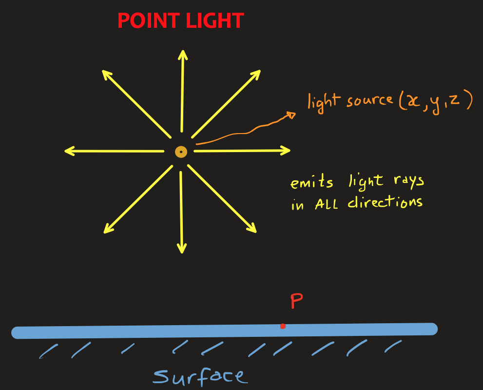

Here we have an example of a _directional light_.

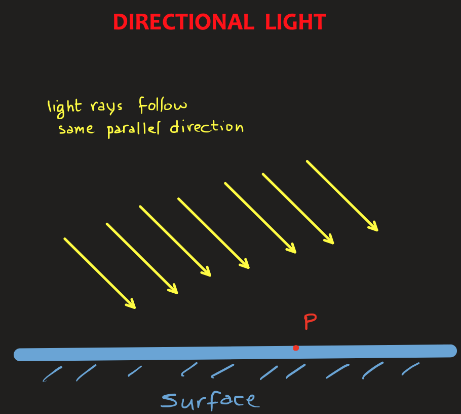

I recommend that everyone check [this OpenGL
tutorial](https://learnopengl.com/Lighting/Light-casters) out to get a better
understanding of these light types (and the one covered in the next project).
Another alternative explanations may be found [here](http://math.hws.edu/graphicsbook/c4/s1.html).

All types of lights introduced here have an _intensity_ field represented as a
3D vector with values in range `[0,1]` that corresponds to the emitted photon
intensity in each of the three color channels, (R, G, B). By setting the
intensity value properly, you might simulate colored lights.

The sniped below demonstrate how these tree types of light source may be coded
in a scene file. These tags should appear within the
`<world_begin/>...<world_end/>` tags. The `scale` attribute is just convenient way
of modulating the light intensity per channel. In the examples below, all have
`scale` set to 1, which means it is not affecting (reducing) the original light
intensity. It is worth noting that it only makes sense to create _a single
ambient light source_ for the entire scene, since it tries to emulate and
overall light reflection that might reach all objects in a scene. For the other
light sources, though, you may create as many as you like.

> [!Note]
> At first glance, the field `scale` may not make much sense and be considered
> redundant since we may change the intensity attribute directly.
>
> However, suppose we define a light with `intensity="0.35 0.78 0.47`.
> What if you want to reduce this light's intensity by 20%?
> You will have to calculate how much is $20\%$ less for all individual channels, right?
>
> With the help of the `scale` field you just need to change it from `scale="1 1 1"`
> to `scale="0.8 0.8 0.8"` to get the desired result.

```xml
<light_source type="ambient"     I="0.1 0.1 0.1"  scale="0.5 0.5 0.5" />
<light_source type="directional" I="0.9 0.9 0.9"  scale="0.4 0.4 0.4" from="1 0.8 -1" to="0 0 1" />
<light_source type="point"       I="0.95 0.9 0.8" scale="0.4 .4 0.4"  from="0.1 3.0 1" />
```

Here is a suggestion for a base class that represents a light source.

```cpp
enum class light_flag_e : std::uint8_t {
	point = 1,
	directional = 2,
	area = 4,
	ambient = 8,
	spot = 16
};

bool is_ambient( light_flag_e flag ) {
	return flag & light_flag_e::ambient;
}
// TODO: create is_direction(), is_point()

class Light {
public:
  light_flag_e flags;
public:
  virtual ~Light(){};
  Light( int flags );
  /// Retorna a intensidade da luz, direção e o teste oclusão.
  vitual ColorXYZ sample_Li( const Surfel&   hit  /*in*/,
                             Vector3f        *wi  /*out*/,
                             VisbilityTester *vis /*out*/ ) = 0;
  virtual void preprocess( const Scene & ) {};
};
```

### 2.2 Support New Material

The `BlinnPhongMaterial` should have the following data members:

- A **diffuse** coefficient, _kd_: It is a 3D vector that indicates how much
  diffuse color is reflected. This is the component that defines the overall
  "color" of the object. For instance, `[0.9, 0.2, 0.2]` represents a
  predominantly red object.
- A **specular** coefficient, _ks_: It is a 3D vector that represents the color
  of the specular highlight. Because we often want to imitate the highlights found
  in the real world, the _ks_ is usually set to be a white (or gray) color, although colored
  highlights area also interesting.
- A **glossiness** exponent: This is a real (`float`) value that controls how
  "narrowed" is the specular highlight in the scene. The larger the value, the
  smaller the region of the specular effect: this would correspond, for instance,
  to highly specular object such as a polished car surface.
  In general terms, this coefficient simulates the _roughness_ of the surface:
  low values for very rough surface, high values for very polished surfaces.
- An **ambient** coefficient, _ka_: It is a 3D vector with each individual
  values in `[0,1]`, that represents how much the incoming light is reflected. For
  instance, `[0.4, 0.4, 0.4]` means that 40% of the incoming ambient light is
  reflected back to the image. Alternatively, you may ignore this coefficient
  altogether and use the _kd_ instead.
  This coefficient simulates a (very) poor approximation for the indirect
  illumination of the scene.

To better understand the interplay among these components and the Blinn-Phong Reflection Model, I recommend reading [this chapter](https://learnopengl.com/Lighting/Basic-Lighting).

The sniped below hopefully will help you understand how these coefficients
should be associated with a material in a scene. In this case we are creating a
_named material_, which means this material information should be stored in the
material library (while parsing is still happening) for later use in the scene
file. The material corresponds to a gold-looking surface, that has a highly
specular coefficient.

```xml
<make_named_material type="blinn" name="gold" ambient="0.2 0.2 0.2" diffuse="1 0.65 0.0" specular="0.8 0.6 0.2" glossiness="256"/>
```

### 2.3 Implement `BlinnPhongIntegrator`

If you have followed the RT architecture suggested in the previous projects, you
need to create a new integrator `BlinnPhongIntegrator` derived from
`SamplerIntegrator` and override the `Li(...)` method.

> [!important]
> All the calculations from the Blinn-Phong Reflection Model should be coded
> inside the `Li()` method.

In the next section you will find a brief description of the theoretical
background necessary to implement the BPRM inside the `Li()` method. Below you
have a top level sequence of steps for the `Li()` method.

```cpp
std::optional<ColorXYZ> BlinnPhongIntegrator::Li( const Ray &ray, const Scene &scene, int depth )
{
    // [1] FIND CLOSEST RAY INTERSECTION OR RETURN AN EMPTY VALUE.
    // [2] SPECIAL SITUATION: IF THE RAY HITS THE SURFACE FROM "BEHIND" (INSIDE),
    //     WE DO NOT COLOR.
    // [3] GET THE MATERIAL ASSOCIATED WITH THE HIT SURFACE.
    // [4] INITIALIZE COMMON VARIABLES FOR BLINN-PHONG INTEGRATOR
    //     (COEFFICIENTS AND VECTORS L, N, V, ETC.).
    // [5] CALCULATE & ADD CONTRIBUTION FROM EACH LIGHT SOURCE.
    // [6] ADD AMBIENT CONTRIBUTION HERE (if there is any).
    return L;
}

```

## 3. The Blinn-Phong Reflection Model

To determine the final color of a pixel associated with a single camera ray, the
BPRM only calculates and adds three color contributions: **diffuse**,
**specular**, and **ambient**. These contributions are computationally cheap to
calculate and allows the RT to portrait matte objects (like clay), shiny objects
(like a polished metal surface), or the combination of both.

Let us investigate each of these three reflections.

### 3.1 The Lambertian Reflection (aka diffuse contribution)

The [Lambertian
reflection](https://en.wikipedia.org/wiki/Lambertian_reflectance) models a
perfect diffuse surface that scatters incident illumination equally in all
directions. Although this reflection model is not physically plausible, it is a
reasonable approximation to many real-world surfaces such as matte paint.

One important point about the Lambertian reflection is **view independent**,
which means regardless of the camera position, the amount of light reflected is
the same. The only factor that influences how much light is reflected back to
the scene is the angle formed between the surface's normal, $\hat{\mathbf{n}}$,
and a vector towards the light direction $\overrightarrow{\mathbf{l}}$. More
precisely:

> "The amount of energy from a light source that falls on an area of surface depends on the angle of the surface to the light."

To calculate the amount of light contribution towards a given view direction
(i.e. the camera ray), first we need to calculate the cosine of the angle
$\theta$ formed between the light source and the surface's normal and use this
value to modulate with the light source intensity and with the material's
properties of reflection (or absorption) of certain wavelengths from the visible
light.

The image below depicts the interplay between these components.

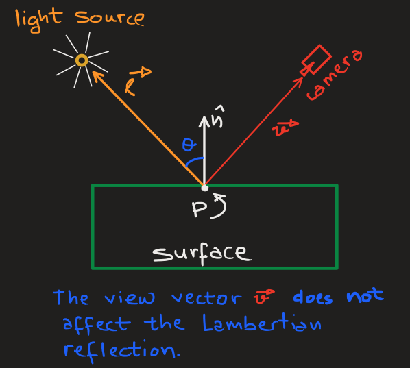

In terms of your RT system the Lambertian reflection receives as an input the following elements:

1. The camera ray: this corresponds to the _view direction_ $\overrightarrow{\mathbf{v}}$;
2. The `Surfel` struct: this contains both the _hit point_ on the surface $P$, and the surface's _normal_ $\hat{\mathbf{n}}$ at that location.
3. The light source: this yields the light direction $\overrightarrow{\mathbf{l}}$.
   - If we have a _point_ light we find the light direction vector by subtracting the light location
     (`Point3f`) from the hit point $P$ to get the vector
     $\overrightarrow{\mathbf{l}}$.
   - If we have a _directional_ we do not need to do anything, because the light
     direction was explicitly informed when the light source was parsed from the
     input scene file.

Once we have all these 3 elements, $\overrightarrow{\mathbf{v}}$, $\hat{\mathbf{n}}$, and, $\overrightarrow{\mathbf{l}}$, we are ready to apply the equation below to get Lambertian reflection contribution and store it in, say, a `L` variable.
$L=I*k_d * max(0, \hat{\mathbf{n}}\cdot \hat{\mathbf{l}})$

> [!important]
> Do not forget to _normalize_ the light direction
> $\overrightarrow{\mathbf{l}}$ because to get the value of $cos(\theta)$ using dot
> product both vectors must be normalized.

The `L` value would be the color of the pixel in the final image, if we were to
consider only the Lambertian reflection. However, the calculations are not over
just yet. We need to add other contributions to the `L` variable, namely the
specular reflection and ambient contribution.

### 3.2 The Specular Reflection (aka specular contribution)

The [Specular reflection](https://en.wikipedia.org/wiki/Specular_reflection)
tries to simulate a fuzzy _spot of light_ on a surface with the same color as
the light hitting the surface. This effect can be seen when you look at a shinny
surface, such as a well polished hood of a car. The center of the specular spot
of light should be located where the direction of your eye (or the camera, in
the RT case) **lines up** with a perfect reflection of the incoming light
direction vector about the surface's normal.

In the image below, the light direction is $\overrightarrow{\mathbf{l}}$, the
hit point is $P$, the normal at the hit point is $\hat{\mathbf{n}}$, the view
direction is $\overrightarrow{\mathbf{v}}$, and $\overrightarrow{\mathbf{r}}$
indicates how the light ray $\overrightarrow{\mathbf{l}}$ would perfectly
reflect about $\hat{\mathbf{n}}$. The yellow lobe represent the range of intensity
of the _specular spot_. Notice that the view direction _is not_ aligned
with the light reflection vector $\overrightarrow{\mathbf{r}}$ and, therefore,
barely touches the yellow lobe; consequently for this particular ray/pixel,
the specular contribution that should be added to the diffuse reflection is
minimal. In practice the location of $P$ in the final image would be somewhere
in the outer rim of the _specular spot_.

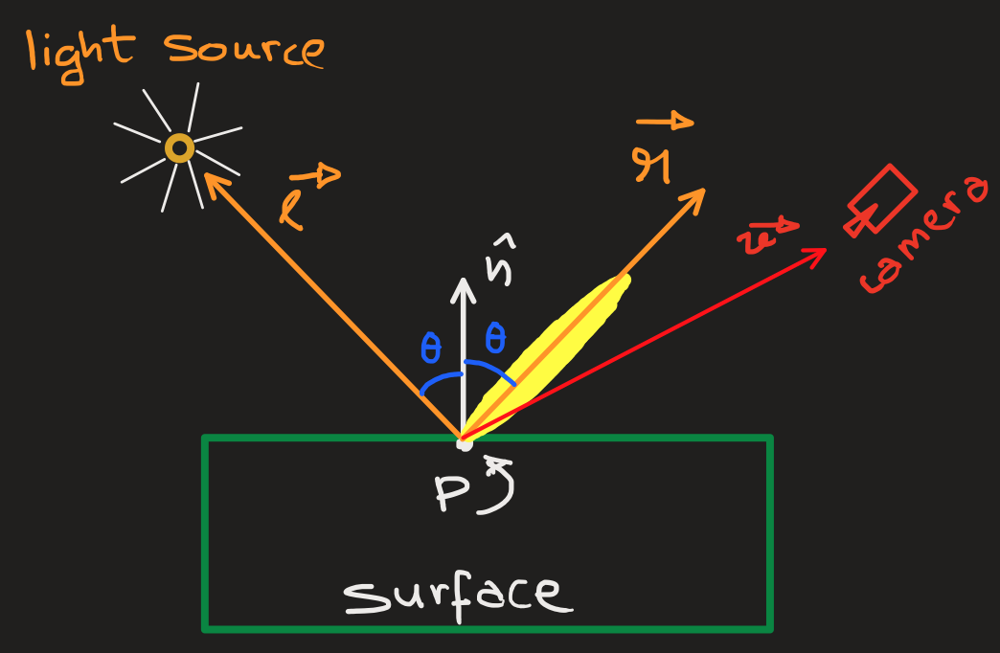

#### Blinn Contribution to the Model

Blinn observed that one way to find out whether the viewing direction $\overrightarrow{\mathbf{v}}$
lines up with the light reflection vector $\overrightarrow{\mathbf{r}}$
**without** having to actually calculate this vector is to consider a normalized
_half vector_ $\hat{\mathbf{h}}$ as the bisector of the smallest angle formed
between $\overrightarrow{\mathbf{l}}$ and $\overrightarrow{\mathbf{v}}$.

Calculating $\hat{\mathbf{h}}$ is cheaper than calculating
$\overrightarrow{\mathbf{r}}$ directly, because it requires one addition and one
division,

$\hat{\mathbf{h}} = \frac{\overrightarrow{\mathbf{v}} + \overrightarrow{\mathbf{l}}}{||\overrightarrow{\mathbf{v}} + \overrightarrow{\mathbf{l}} ||}$

whereas the other requires the normalization of $\overrightarrow{\mathbf{l}}$,
one dot product, one vector multiplication and one vector subtraction.

$\hat{\mathbf{r}} = \hat{\mathbf{l}}-2(\hat{\mathbf{l}}\cdot \hat{\mathbf{n}})*\hat{\mathbf{n}}$

Once you determined the _half vector_ $\hat{\mathbf{h}}$ you need to measure how
close this vector is to the surface normal $\hat{\mathbf{n}}$ by calculating the
cosine of the angle they form. If we use the cosine measurement alone to module
the specular contribution, we would end up with very large spots (the yellow
lobe would be "fatter"). To make this contribution decrease rapidly, the Phong
reflection model introduces the _Phong exponent_: an exponentiation factor
applied to the cosine, so that small changes in the cosine would reduce greatly
the specular contribution, if the _Phong exponent_ is high.

Below you will find an image demonstrating how the exponent $g$ affects the
original cosine function, making it decrease rapidly with small angle variation.

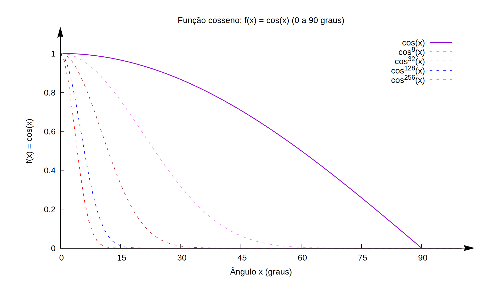

Here is the representation of the cosine function in our lighting diagram.
The specular intensity is represented by the yellow lobe.

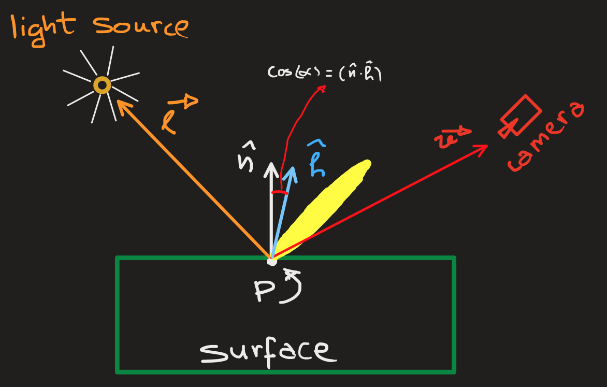

Put simply the _Phong exponent_ is just a math "trick" introduced to allow us to
control how small or large the _specular spot_ is on a surface.
It simulates the "roughness" of the surface, as stated before.
In our formulation, let us call the _Phong exponent_ $g$, to associate with the term
_glossiness_. With the addition of the specular contribution, our shading
equation becomes

$L = I*k_d * max(0, \hat{\mathbf{n}}\cdot \hat{\mathbf{l}}) + I*k_s*max(0,\hat{\mathbf{n}} \cdot \hat{\mathbf{h}})^g$

where $k_s$ is the _specular coefficient_ of the material assigned to the surface.

The image below demonstrates the effect of the specular reflection on several
gray spheres. The left most sphere has no specular reflection, only diffuse
contribution. The following spheres, from left to right, each has assigned a
power of two value to the $g$ exponent, starting at `0`, `2`, then `4`, `8`, etc., up
to `512`. Notice how the _specular spot_ shrinks rapidly as the $g$ values
increases, to become a very small yellowish spot in the right most sphere. The
light source is a directional yellowish light, and the camera is orthogonal.

<!--  -->


### 3.3 The Last Component: the Ambient Contribution

Depending on how you set up the lights for a given scene, some objects may
appear completely dark in the final image, if they do not receive any
contribution from diffuse and specular reflections. This could happen, for
instance, if we create a scene with only a single light and a black background.
In the real world, however,
objects in a scene often receive, at least, a small amount of lighting coming
from outside or even reflected off some wall of other reflective surfaces
present in a scene. This is called [indirect
illumination](https://en.wikipedia.org/wiki/Global_illumination) and, in
reality, this phenomenon is responsible for most of the light contribution we
see in a real world scene. However, simulating such visual effects is extremely
complex and computer intensive. Indirect Illumination is normally done with
sophisticated physically based rendering algorithms implemented with Monte Carlo
integration, such as [ **path tracing** ](https://en.wikipedia.org/wiki/Path_tracing).

Not so long ago computer graphics systems and computers could not handle such
computer-intensive algorithms because of the computer processing power
constraints of the time. So, earlier computer graphics scientists were forced to
be very "creative" in designing algorithms that were not necessarily
_physically_ correct but produced visually pleasant images that would
approximate the real ones. The **ambient** contribution is classic example of
such ingenuity. In short: this component in the BPRM is an arbitrary way of simulating the
_indirect illumination_ described above.

In this project, ambient lighting is simply calculated as the product of the
material color, $k_a$ associated with a surface and the overall ambient light
intensity $I_a$. Because we may have individual $k_a$ coefficients associated
with a material, is possible to control how individual material are affect by
this overall ambient light.

$L=I_a*k_a + I * k_d*max(0,\hat{\mathbf{n}}\cdot \hat{\mathbf{l}}) + I*k_s * max(0,\hat{\mathbf{n}}\cdot\hat{\mathbf{h}})^g$

### 3.4 Multiple Lights and the Final BPRM Equation

Because the light contribution in a scene with multiple light sources is
cumulative, we can simply add the contribution of individual lights together to
produce the overall lighting effect we desire. Therefore, if a scene has a set
of $k$ light sources defined, each with individual intensity $I_i$, we would
apply the full BPRM equation below to obtain the color of a single pixel `L`:

$L=I_a * k_a + \sum^{k}_{i=1}[I_i*k_d*max(0,\hat{\mathbf{n}}\cdot \hat{\mathbf{l}}) + I_i*k_s*max(0,\hat{\mathbf{n}}\cdot \hat{\mathbf{h}})^g]$

where

- $I_i$ [`Vector3f`]: is the intensity of the $i$-th light source (we may have several of these in a scene).
- $I_a$ [`Vector3f`]: is the single ambient light intensity (just one for the entire scene).
- $k_a$ [`Vector3f`]: is the ambient coefficient of the material.
- $k_d$ [`Vector3f`]: is the diffuse coefficient of the material.
- $k_s$ [`Vector3f`]: is the specular coefficient of the material.
- $g$ [`float`]: is the specular exponent of the material (`glossiness`).
- $\hat{\mathbf{n}}$ [`Normal3f`]: is the normal vector at the location where the ray hit the surface.
- $\hat{\mathbf{l}}$ [`Vector3f`]: is the normalized light direction.
- $\hat{\mathbf{h}}$ [`Vector3f`]: is the normalized half vector, or the bisector of the angle between the view vector $\overrightarrow{\mathbf{v}}$ and the light direction vector $\overrightarrow{\mathbf{l}}$
- $\hat{\mathbf{n}}\cdot \hat{\mathbf{l}}$ [`float`]: corresponds to the $\cos(\theta)$, the angle between $\hat{\mathbf{n}}$ and $\hat{\mathbf{l}}$.
- $\hat{\mathbf{n}}\cdot \hat{\mathbf{h}}$ [`float`]: corresponds to the $cos(\alpha)$, the angle between $\hat{\mathbf{n}}$ and $\hat{\mathbf{h}}$.

## 4. The Scene File Format

You will find examples of scene file format with the new tags introduces in this project [here](./scenes/lights_scene/demo_all_lights.xml), and the corresponding images [here](./scenes/resulting_images/).

Here, an image showing a scene with a directional light, black background and 4 spheres.
Note how the dark side of the spheres blends with the background, making it indistinguishable from the background.

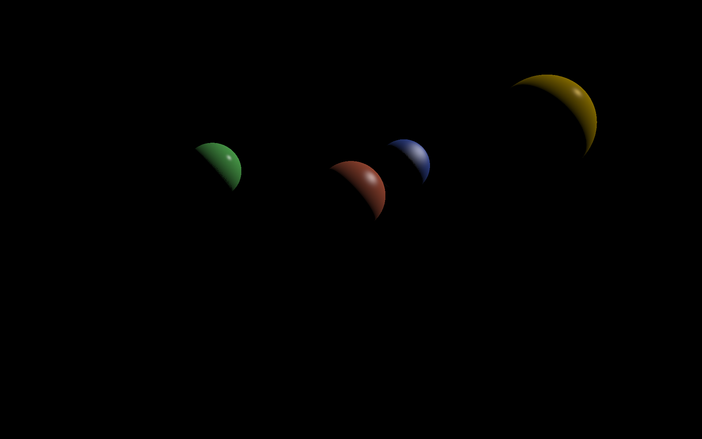

Below, we have the same scene but now with the introduction of the ambient light contribution to the rendering.

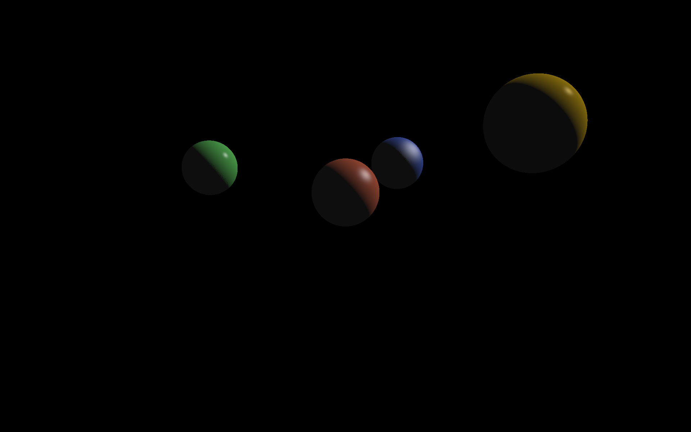

Here, we have a similar scene, with background and a giant sphere simulating the floor.
However, this image was rendered only with ambient contribution.


The same scene with only a single directional light.

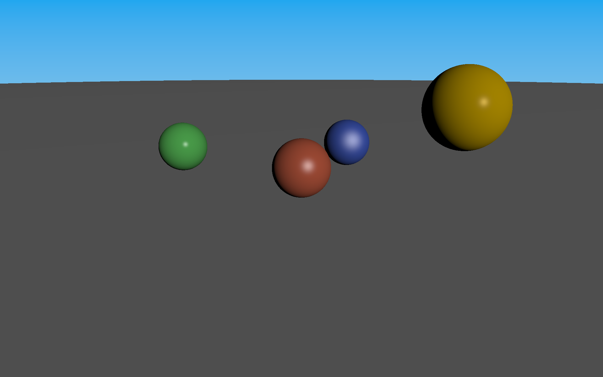

The same scene now with only a single point light.

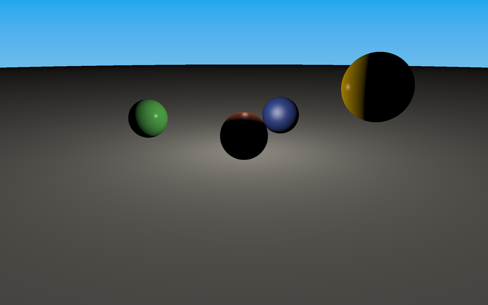

Now the same scene with all three types of lights combined.

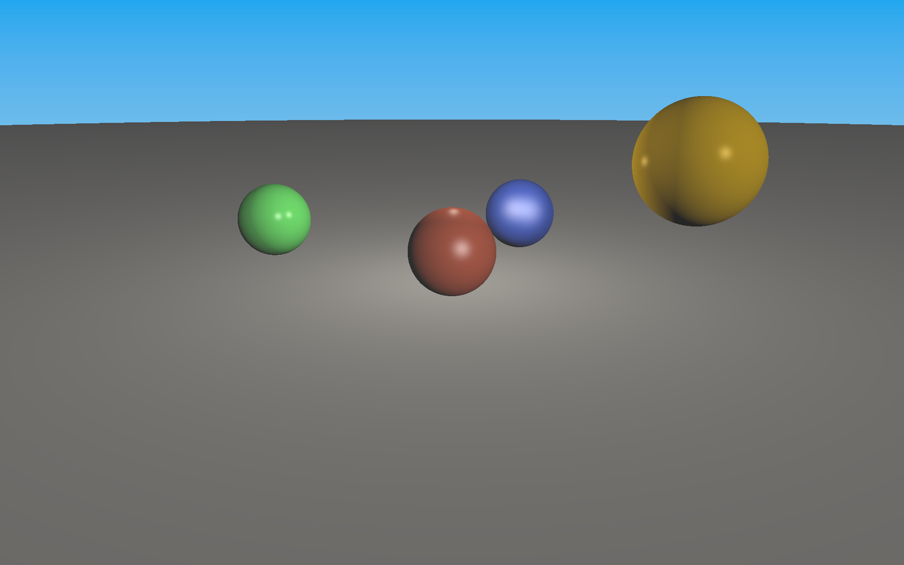

But the overall effect of the lights becomes evident only if
we add shadows.
Below we have the same scene, all lights on, rendering
hard shadows (the subject of the next project!).

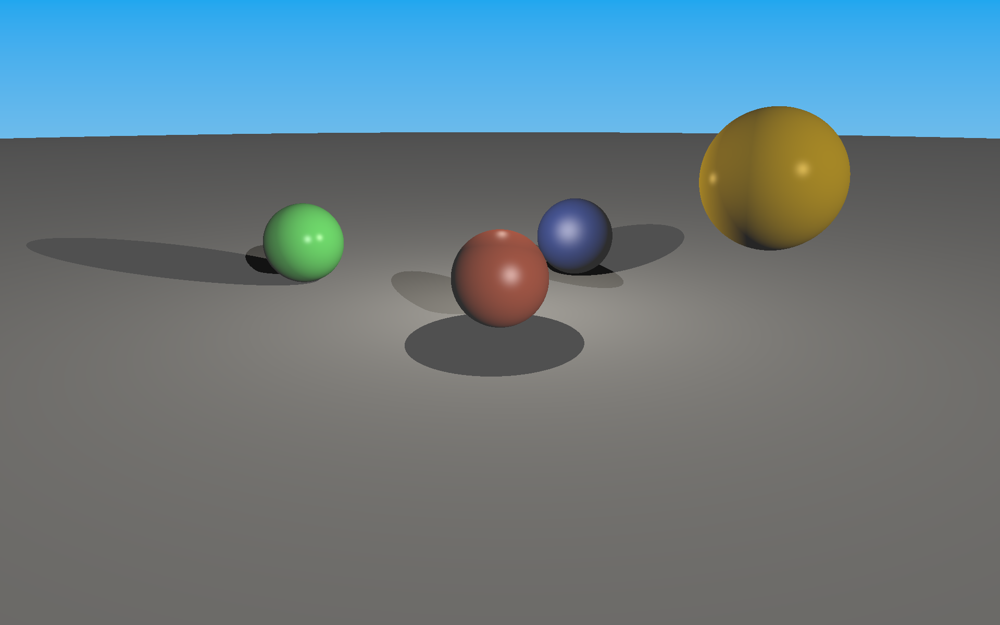

Note that only with the addition of shadows we are able to perceive that the big golden sphere is floating above the ground, since it does not cast shadow as the other spheres do.
The shadow of the big sphere exists, but it is cast to a position on the ground outside the camera view.

## 5. Extra Feature: light attenuation

Make your Blinn-Phong integrator support light attenuation!

Light is preserved while traveling in the space (vacuum). However, while traveling through a medium such as the air,
water or a room full of dust, its intensity should be reduced (attenuated) at a rate inversely proportional to the squared distance between the light source and the point that
receives the light.

To support this feature I recommend reading the section **Attenuation** [here](https://learnopengl.com/Lighting/Light-casters).
To implement the suggested model, you will need to
add the 3 attenuation constants to each point light definition you want to apply the effect.
These constants try to model the attenuation effect of the medium that fills up the empty "spaces" in the scene.
You may add the following attribute to your point light tag.

$ F\_{att}=\frac{1}{K_c + K_l*d + K_q*d^2}$

where:

- $d$ is the distance between the hit point at the surfel and the point light location in the world.
- $K_c$ is the constant coefficient.
- $K_l$ is the linear coefficient.
- $K_q$ is the quadratic coefficient.

```xml
<!--- Attenuation -->
<light_source type="point" ... attenuation="1.0 0.22 0.20"/>
```

where these values correspond, respectively, to constant, linear, and quadratic attenuation coefficients.

Below you will find the attenuation effect in action, generated with this [scene](./scenes/attenuation/demo_attenuation.xml).
Each image was generated with a point light with same configuration except for the attenuation coefficients.
The attenuation, somehow, may simulate the "intensity" of the light, although we are not changing the intensity value directly.

Attenuation at distance 7.
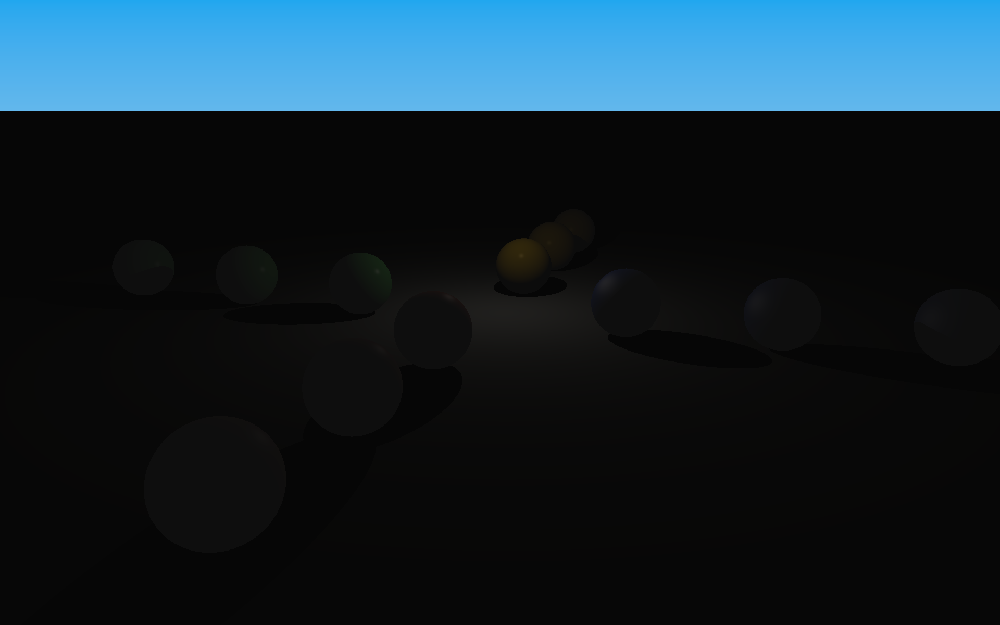

Attenuation at distance 20.
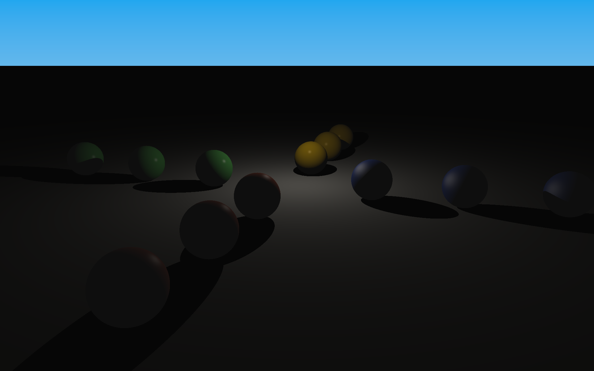

Attenuation at distance 32.
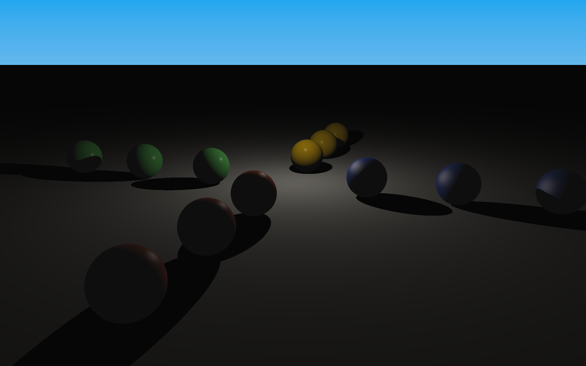

Attenuation at distance 50.
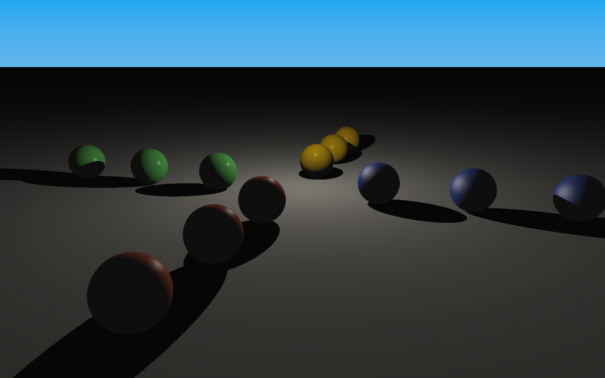

Attenuation off.
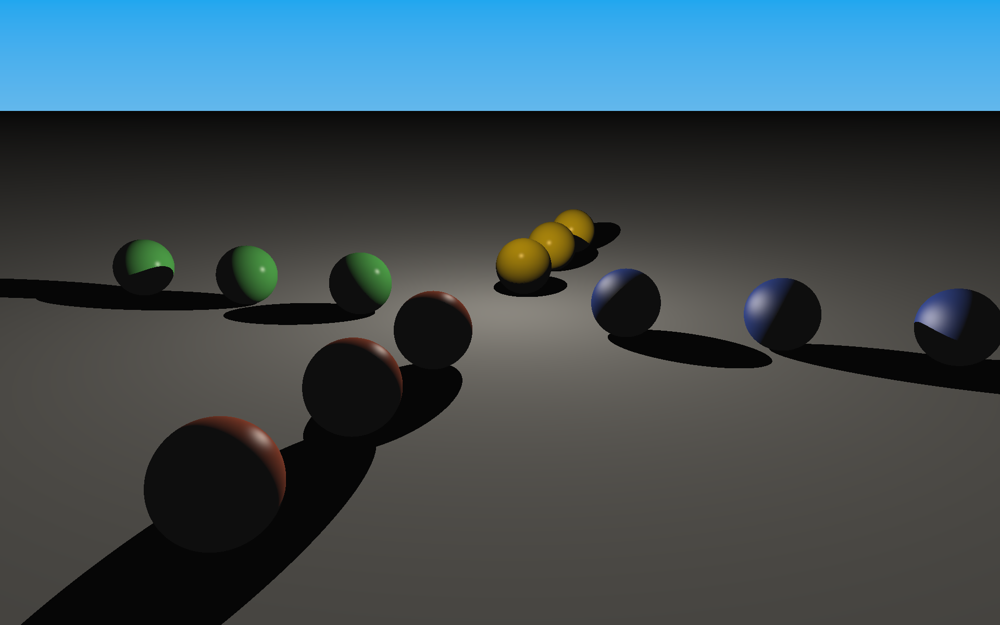
