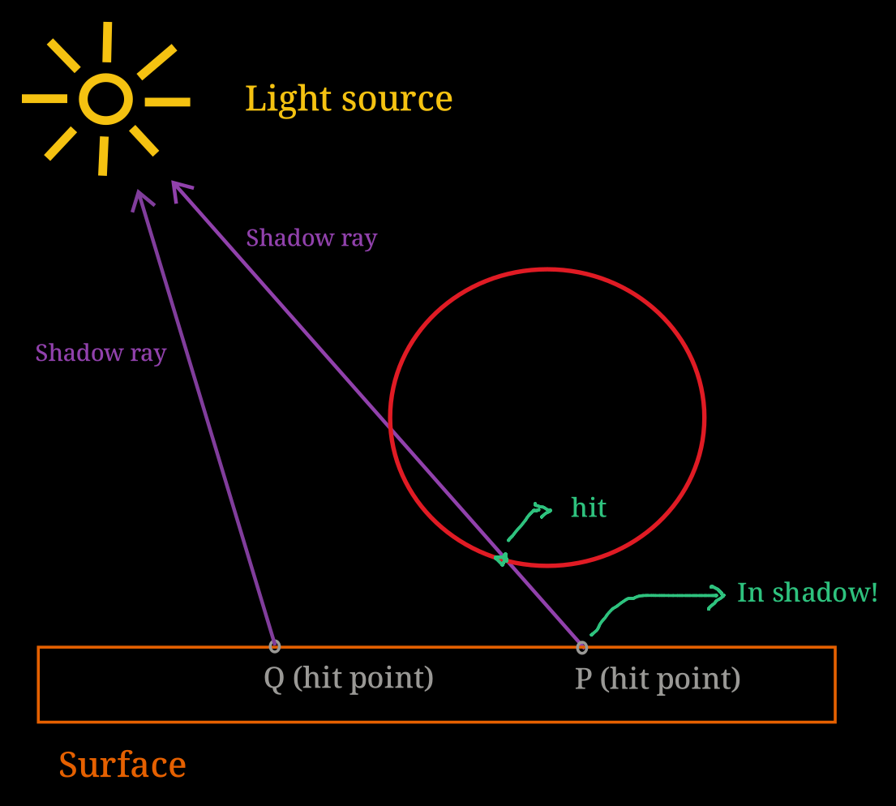
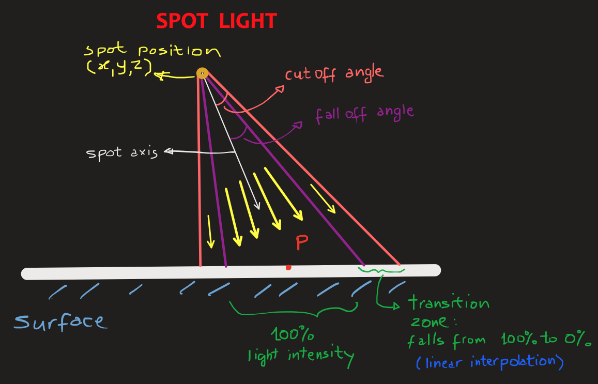
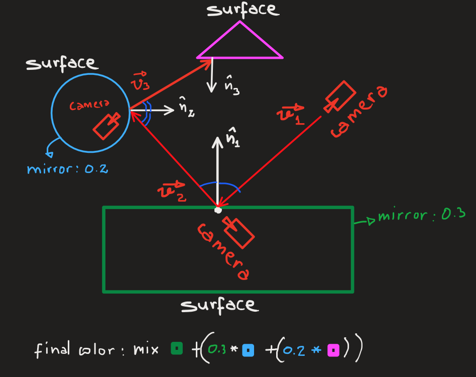
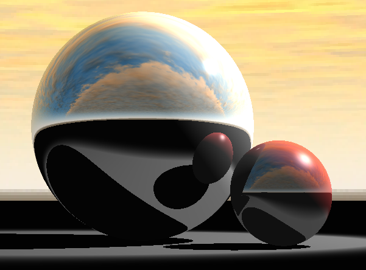
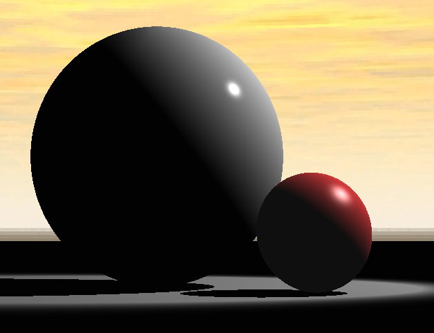
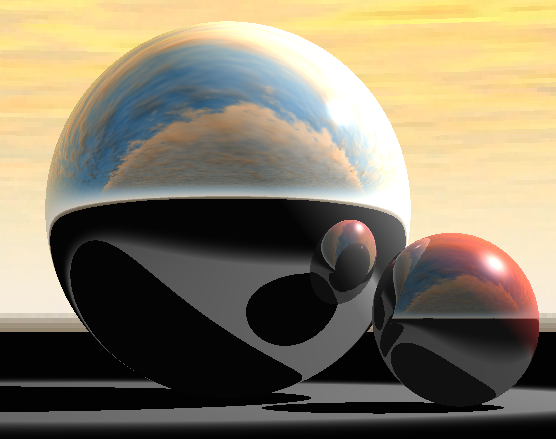
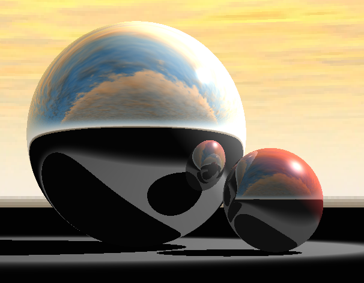
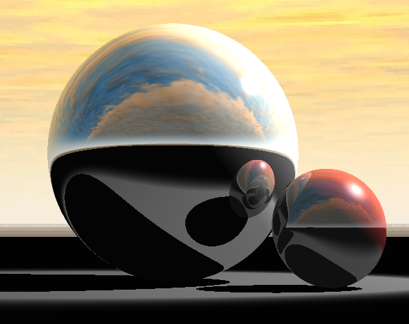
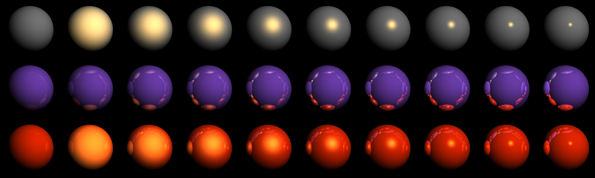
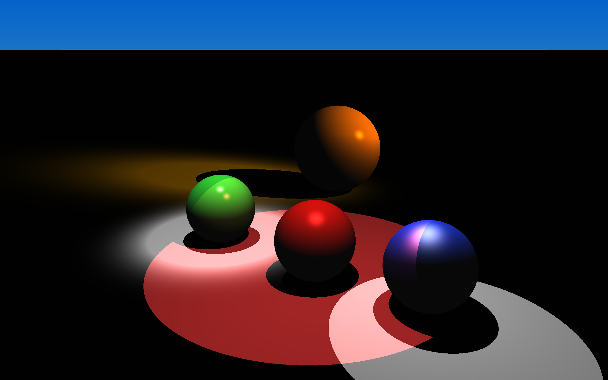

**COMPUTER GRAPHICS I (DIM0451) -- Ray Tracer Project**

# Project 06 - Shadows and Perfect Reflections

<!--toc:start-->

- [Project 06 - Shadows and Perfect Reflections](#project-06-shadows-and-perfect-reflections)
  - [1. Introduction](#1-introduction)
  - [2. Adding Shadows](#2-adding-shadows)
    - [The Visibility Tester Class](#the-visibility-tester-class)
  - [3. Adding Spotlight](#3-adding-spotlight)
  - [4. Adding Ideal Specular Reflection](#4-adding-ideal-specular-reflection)
- [Reference Scenes and Images](#reference-scenes-and-images)
<!--toc:end-->

## 1. Introduction

In this project we will continue to improve the Blinn-Phong Reflection Model by
adding the rendering of **shadows** and supporting **perfect reflection** (mirroring).

The presence of shadows is and important visual cue that help us spatially
locate objects in the scene, and improve the overall 3D appearance of a scene.

The perfect reflection is a visual effect that improves realism of a scene,
specially if combined with texture (future project).
To add this capability to our integrator, we will need to add a new attribute to
the Blinn-Phong material.

We will also introduce the **spotlight**, a new type of light based on the point
light previously implemented.
A spotlight is a point light that has its light output restrict by a cone; only
objects located inside this invisible cone will receive light.

## 2. Adding Shadows

Recall that at the end of Project 05 your RT were able to render the Blinn-Phong reflection
model (BPRM) with the diffuse and specular components for multiple light source.

For a scene that has a set of $k$ light sources defined, each with individual intensity $I_i$, we would
apply the full BPRM equation below to obtain the color of a single pixel `L`:

$L=I_a * k_a + \sum^{k}_{i=1}[I_i*k_d*max(0,\hat{\mathbf{n}}\cdot \hat{\mathbf{l}}) + I_i*k_s*max(0,\hat{\mathbf{n}}\cdot \hat{\mathbf{h}})^g]$

where

- $I_i$ [`Vector3f`]: is the intensity of the $i$-th light source (we may have several of these in a scene).
- $I_a$ [`Vector3f`]: is the single ambient light intensity (just one for the entire scene).
- $k_a$ [`Vector3f`]: is the ambient coefficient of the material.
- $k_d$ [`Vector3f`]: is the diffuse coefficient of the material.
- $k_s$ [`Vector3f`]: is the specular coefficient of the material.
- $g$ [`float`]: is the specular exponent of the material (`glossiness`).
- $\hat{\mathbf{n}}$ [`Normal3f`]: is the normal vector at the location where the ray hit the surface.
- $\hat{\mathbf{l}}$ [`Vector3f`]: is the normalized light direction.
- $\hat{\mathbf{h}}$ [`Vector3f`]: is the normalized half vector, or the bisector of the angle between the view vector $\overrightarrow{\mathbf{v}}$ and the light direction vector $\overrightarrow{\mathbf{l}}$
- $\hat{\mathbf{n}}\cdot \hat{\mathbf{l}}$ [`float`]: corresponds to the $\cos(\theta)$, the angle between $\hat{\mathbf{n}}$ and $\hat{\mathbf{l}}$.
- $\hat{\mathbf{n}}\cdot \hat{\mathbf{h}}$ [`float`]: corresponds to the $cos(\alpha)$, the angle between $\hat{\mathbf{n}}$ and $\hat{\mathbf{h}}$.

The target result was the scene below, which have all three types of lights combined, but missing shadows.


After the implementation of shadows into your RT, you will be able to render this [same
scene](./scenes/lights_scene/demo_all_lights.xml) and produce the image below


To add shadow to this scene is relatively easy.
You must do the following: every time a ray hits a surface at, say, `P` your
integrator must shoot another ray, called **shadow ray**, from `P` towards the
light source position in space. The origin of the ray corresponds to the ray
parameter `t=0`, while the light position `location` corresponds to `t=1`. Then
you ask the scene to see if this new shadow ray intersects any object: a
positive answer would mean that there is "something" between the original hit
point `P` and the light's location in space blocking the light path. Therefore,
the color at `P` should be black (the shadow color) or the _ambient
contribution_ if one is set.

The image below shows an abstract representation of the process described above.
The point $P$ is in shadow because the shadow ray $r_s(t)=P+t\overrightarrow{\mathbf{l}}$ hits a sphere present in the scene.
The $\overrightarrow{\mathbf{l}}$ is the vector towards the light.

The shadow ray starting at the hit point $Q$, $r_s(t)=Q+t\overrightarrow{\mathbf{l}}$, however, hits nothing.
Therefore, the hit point $Q$ must be colored as usual, since it is not in shadow.



Notice that we do not need to determine any intersection information of the
shadow ray besides the `true` or `false` indicating that an intersection
happened. So this is the perfect opportunity to call the simpler `intersect_p()`
version of the intersection methods defined by the `Primitive` class.

In the case of **directional** lights we may have a problem while casting
shadows. Let us see why. We have the surface hit point `P` (the shadow ray
origin), we have the shadow ray `direction` (from the directional light data)
but we do not have the `location`, or the end-point of the shadow ray to test
for intersection.

Put simply, we want to answer: _How far along the shadow ray should I keep
testing intersection for?_ The answer is: we stop the shadow ray when it goes
beyond the scene's limits. This limit would correspond to a giant sphere or box
that encompasses all objects in the scene. So, to determine the scene's limits
or bounds, we need to create a bounding box around each primitive in the scene.
In this way, the entire scene's bounding box is the union of all (smaller)
bounding boxes. The maximum extent the shadow rays is valid for corresponds to
the diagonal of that (giant) bounding box.

Therefore, to support shadows with directional lights, we need to create a bound
box for every primitive. During the `preprocess()` of the rendering, we call the
`preprocess()` of the lights. That method should determine the maximum extent or
length for the shadow ray, based on all bounding boxes associated with the
primitives. The implementation of the bounding boxes for primitives will also
pay off later on, when we implement the _Bounding Volume Hierarchy_ data
structure that enables the **acceleration** of the intersection test rays-scene.

Another way we can solve this problem is by specifying in the scene file the
"radius" of the world.
This could be done by adding a new attribute to the direction light, called
`world_radius`.

```xml
<light_source type="directional" I="0.9 0.9 0.9" scale="0.4 0.4 0.4" from="1 1.45 -3" to="0 0 1" world_radius="50" />

```

Ultimately, you may try to find a way to create a shadow ray based only on the point of
interest and the light direction, avoiding the calculation of the world's bounds
altogether, and the need of providing the world radius in the scene file.

### The Visibility Tester Class

One way of encapsulating the creation and test of the shadow ray inside the `BlinnPhong::Li()` is to create a class called `VisibilityTester`.
This class receives two `Surfel` objects: the hit point and the light location.
The method `unoccluded()` (1) receives a scene, (2) creates the shadow ray from `p0`
to `p1` or `p0` and a `direcion`, (3) test this new ray for intersection with the primitives inside the scene.
If it hits anything it stops and returns `true`; otherwise it returns `false`.

```cpp
// Verifica se há oclusão entre dois pontos de contato.
class VisibilityTester {
public:
  VisbilityTester()=default;
  VisbilityTester( const Surfel&, const Surfel& );
  VisbilityTester( const Surfel&, const Vector3f& ); // For directional
  bool unoccluded( const Scene& scene );
public:
  Surfel p0, p1; //!< Test visibility between p0 and p1.
  Vector3f direction; //!< Direction to test visibility from p0.
};
```

## 3. Adding Spotlight

**Spotlight** is a particular type of point light that have a _cone of
influence_: only objects inside this cone receive light rays. Examples of this
type of light in the real world include a flashlight or a desk lamp (recall the
[Pixar's Luxo Jr.](https://en.wikipedia.org/wiki/Luxo_Jr.)).

We may have a _hard-edge_ spotlight or a _soft-edge_ spotlight. In a hard-edge
spotlight, the light intensity inside the cone is the same, whereas in a
soft-edge spotlight, we have a _transition zone_ (a cone within a cone) where
the light intensity linearly decreases from its normal intensity value to zero as it goes
through the transition zone. In the later case, the edge of the spotlight
appears blurred.

Here we have a depiction of a _spotlight_.



I recommend that everyone check [this OpenGL tutorial](https://learnopengl.com/Lighting/Light-casters) out to get a better understanding of these four light types. Another alternative explanations may be found [here](http://math.hws.edu/graphicsbook/c4/s1.html).

The sniped below demonstrate how to declare a spotlight in the scene file.

```xml
<light_source type="spot" I="0.5 0.5 0.4" scale="1 1 1" from="1.5 5 -8" to="1.5 -2 -8" cutoff="30" falloff="15" />
```

## 4. Adding Ideal Specular Reflection


One nice addition to the RT is mirror effect. It is simple to code and might add a dramatic effect to your scenes.

Coding mirror effect becomes easy because all we need to achieve that is already inside the RT. We have rays, vectors, the scene, and the method `Li()` that has access to all these elements and determines the color for a single pixel.

So, the first step is to add and extra attribute to the Blinn-Phong material
tag. The attribute should be called `mirror`
and defines how much light should the mirror material reflect into the scene.
The sniped below describes a material that reflect only 40% of the incident
light.

```xml
<make_named_material type="blinn" name="gold" ambient="0.2 0.2 0.2" diffuse="1 0.65 0.0" specular="0.8 0.6 0.2" glossiness="256" mirror="0.4 0.4 0.4"/>
```

Although there are several types of material that reflect light in one way or
another, we are interested, at this point, in the so-called **perfect mirror**.
This means that the incoming light ray must reflect at the perfect reflection
angle, which is the reflection of the incoming angle about the surface normal.

> [!Note]
> A material that does not reflect light perfectly, should have the `mirror` attribute
> set to zero or omitted.

To determine the color at the surface point of contact we have to follow the
reflected ray $\mathbf{\hat{r}}$ into the scene. This means making a recursive
call to the `Li()` function that does exactly that: follows rays into the scene
and determines the color for it.



So we the color at the first point of contact is given by:

```cpp
// [1] Determine color L based on the Blinn-Phong model
// [2] Find new ray, based on perfect reflection about surface normal.
Ray reflected_ray = ray - 2(dot(ray,n))*n;
// [3] Offset reflect_ray by an epsilon, to avoid self-intersection caused by rounding error.

// [4] Recursive call of Li() with new reflected ray.
if ( depth < max_depth ){
   L = L + km * Li(refected_ray, scene, depth+1);
}
```

where `km` is the `mirror` coefficient we read earlier from the scene description file. The `if` is necessary to make our RT follow the light ray up to a certain recursion depth, otherwise we might be caught in an infinit loop of the scene was full of mirror surfaces, for example. The `max_depth` parameter is passed to the RT as a field (tag) of the `integrator` part of the scene.

Here is an image created with just one level of recursion.



> [!Note]
> The same reason that made us _offset_ the shadowray to avoid self-shadowing,
> will require us to _offset_ the mirror-ray to avoid a premature termination
> of the color calculation, since the mirror-ray might hit the very surface it
> is spawning from.

The result of incorporating mirrors into your scene can be seen below. We have a sequence of 5 images: the first one has no mirror. The following images add progressive depth levels of mirror-ray reflections. Note that as the level of recursion increases we begin to have reflections of reflections of reflections, emulating an effect similar to what happens when you put a mirror in front of another.







# Reference Scenes and Images

In this section you will find the list of reference scenes and their corresponding images.

Here is the result of [scene](./scenes/rows_mirror_spheres/strip_of_spheres.xml) simulating the mirror effect.



Here is the image produce by this [scene](./scenes/spot_scene/spotlights.xml) with several spotlights.


